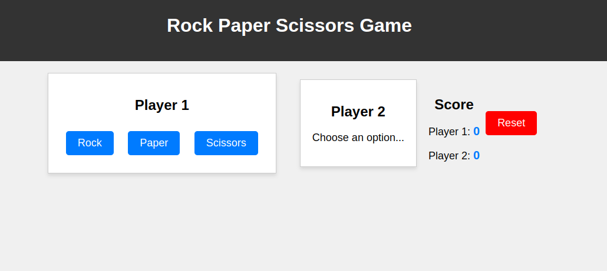

# Rock Paper Scissors Game

This is a simple implementation of the classic Rock, Paper, Scissors game using HTML, CSS, and JavaScript. It allows two players to make their choices and keeps track of the score. This project is designed to help you practice your JavaScript skills and create a fun game.

## Features

- User interface for player choices.
- Game logic to determine the winner of each round.
- Score tracking for both players.
- Reset button to start a new game.
- Runs in a web browser.

## How to Play

1. Open the `index.html` file in your web browser.
2. Each player can click on one of the buttons (Rock, Paper, or Scissors).
3. The game will determine the winner of each round and update the score.
4. To start a new game, click the "Reset" button.

## Code Files

- `index.html`: Contains the HTML structure of the game.
- `style.css`: Provides styles for the game interface.
- `script.js`: Contains the JavaScript code for game logic and interactivity.

## Game Logic

- The computer randomly selects Rock, Paper, or Scissors for Player 2.
- The winner of each round is determined based on the classic rules: Rock beats Scissors, Scissors beats Paper, and Paper beats Rock.
- The score is updated accordingly.

## Customize and Enhance

Feel free to customize and enhance this game further. Here are some ideas:

- Add animations for player selections.
- Incorporate sound effects for a more engaging experience.
- Create a responsive design for better usability on different devices.
- Implement a timer for each round.

## License

This project is licensed under the MIT License - see the [LICENSE](LICENSE) file for details.

## Acknowledgments

- Built with inspiration from the classic Rock, Paper, Scissors game.
- Developed for educational purposes and as a programming exercise.

Enjoy the game and happy coding!
